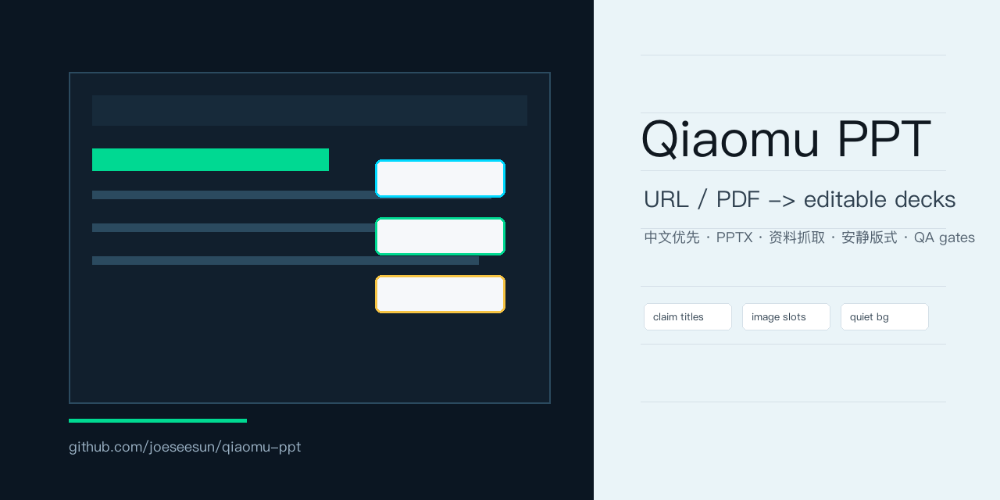
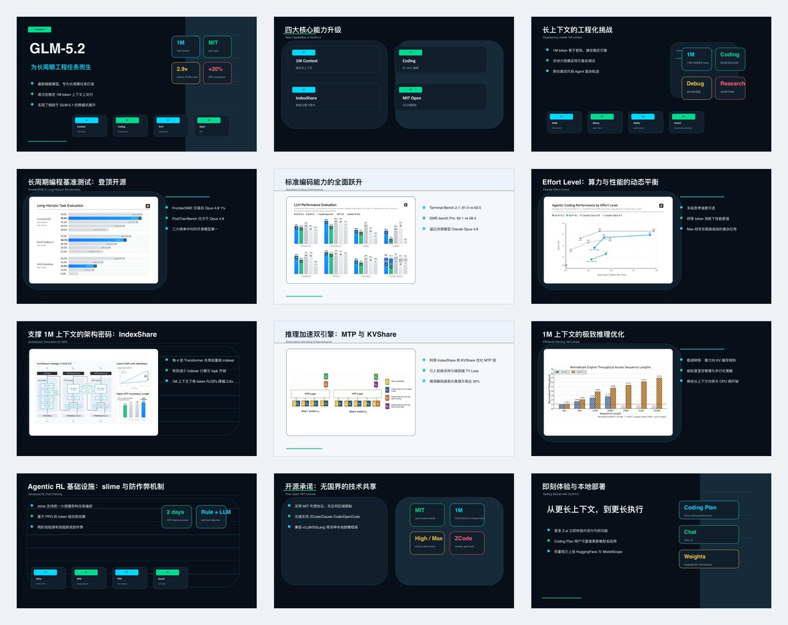

# Qiaomu PPT

中文优先的 PPT 生成工作流：把主题、文档、URL、PDF、旧 deck 或课程材料，变成可编辑、可讲、可验证的演示文稿。

`qiaomu-ppt` 不是模板仓库，也不是把几个上游 skill 打包转卖。它把 PPT 创作拆成一条可复用的生产线：先抓取资料，再判断路线，再写有说服力的内容结构，再锁定安静、克制、可读的视觉系统，最后用质量门检查导出证据。



示例缩略图：



## 亮点

- 多源资料到 PPT：用户给 URL、飞书导出、PDF、EPUB、Office、Markdown、图片、ZIP 或文件夹时，内置 `scripts/source_to_markdown.py` 会统一提取正文、图片候选、PDF 页面图和缺口，保存 `source_manifest.json`，并默认生成 `source_notes.md` / `source_cards.json` 作为第一版证据卡。
- 多源摄取回归矩阵：`source_intake_matrix_smoke.py` 会离线生成 Markdown、HTML、DOCX、PPTX、XLSX、图片和 ZIP fixtures，逐个跑 `source_to_markdown.py`，检查 `source_manifest.json`、extracted Markdown、source cards、图片候选和 missing-evidence 标记，防止文件/资料入口被后续迭代改坏。
- 证据侧面卡：`scripts/source_cards.py` 会把短资料拆成去重后的事实、文本、机制、冲突、影响等证据侧面；文件名、来源标题留在 metadata，不进入可见页面。
- 角色化大纲：`scripts/outline_from_source_cards.py` 会把证据卡匹配到语境、核心文本、机制、冲突、社会解读、比较、影响、反驳、综合等叙事角色，同时把 `component_plan.component_type` 写成 Lxx 对应的可执行版式家族，例如 `process_flow`、`concept_map`、`chart_with_takeaway`，避免为了凑页数反复复读同一条 claim，也避免版式计划写了 L13/L24、实际合同仍是普通卡片页。
- 标题不截断：可见 claim title 必须是短判断，长证据留在 `source_anchor`、正文或备注；`check_project.py` 会拒绝带 `...` / `…` 的标题和过长中文标题，避免 PPTX/HTML 渲染时标题被截断。
- 一键项目准备：`scripts/prepare_deck_project.py` 把主题、文件或链接先变成标准项目骨架，自动串起资料摄取、证据卡、大纲种子、风格/版式推荐、视觉契约、入选 source visual 定向解析、设计提案和预览闸门；只有主题时默认先跑 fast topic research，抓取可用来源并生成 source cards，失败或显式跳过时才只生成研究 brief。
- 论文到 PPT：用户给 arXiv 或 Hugging Face Papers 链接时，内置 `scripts/paper_to_markdown.py` 会归一化 arXiv ID，优先抓取 arXiv e-print TeX 源码，提取正文、图、表、caption 和 source cards；没有 TeX 时才降级到 PDF 文本。
- 微信公众号文章入口：`mp.weixin.qq.com` 会被标记为 `wechat_article` 特殊来源；普通抓取只是 baseline，图片/懒加载/防盗链不足时按 `references/wechat-source-intake.md` 选择开源专用解析器。
- URL / PDF 轻量入口：用户说“做一个 PPT：URL”时，仍可用 `scripts/url_to_markdown.py` 快速抓取网页/PDF正文、发现图片、渲染 PDF 前几页为 source visual candidates、保存 `source_manifest.json`。
- 主题研究闸门：用户只说“做一个 PPT 介绍蒲松龄”这类宽主题时，默认先联网研究，建立 `source_manifest.json`、`source_notes.md`、`source_cards.json`，再和用户确认角度，不从题目直接编页。
- 可编辑优先：默认面向 PowerPoint/PPTX，而不是只生成一张好看的网页截图。正常 PPTX 必须有可编辑的标题、正文、数字、图表、标签、卡片、图片框和图示前景层；整页 PNG/JPG/PDF 只能作为 `image-backed` 预览、小红书发图或用户明确接受的非编辑稿。
- 高保真与可编辑同源：不要先做一套漂亮 HTML/PNG，再另画一套低质可编辑版。预览、SVG 和 PPTX 应共享同一份 `slide_plan.json`、`spec_lock.json` 和 `layout_execution_contract`；需要质感时只把纸张纹理、柔光、氛围图或摄影层栅格化，阅读内容和版式结构保持可编辑。
- SVG-first 可编辑 PPTX：主路径是 `design_spec.md` / `spec_lock.md` / `svg_output/*.svg` / 视觉预览 / `scripts/svg_to_pptx.py`，再用 LibreOffice 渲染回看。`scripts/pptx_from_slide_plan.py` 只作为快速草稿和低复杂度兜底。不依赖外部 `pptx` skill 运行。
- PPTX 操作纪律：吸收 Anthropic `pptx` skill 的方法论，但不复制 proprietary 材料：读/分析、模板编辑、从零生成是三条不同路线；旧 deck/template 要先做缩略图和文本盘点，再映射内容到多样版式；结构操作先于内容替换；最后必须经过 PPTX 文本检查和渲染回看。
- 语义对象分组：SVG-first 路线会把每页切成顶层语义组，例如 `background`、`media`、`title`、`proof`、`body`、`footer`，并写入 `spec_lock.json`。这些组是 PPTX 局部编辑和动画锚点，不只是视觉包装。
- 图片嵌入提速：`finalize_svg.py` 默认按 SVG 最终显示尺寸自动降采样再嵌入图片，避免 PDF 页面图、微信长图、论文截图用 2400px 原图塞进 460px 图框导致 PPTX 体积和导出时间膨胀；需要保留原始分辨率时可加 `--no-auto-downsample-images`。
- 主题专用 SVG 预览：`scripts/svg_deck_from_slide_plan.py` 会区分样例专用渲染和通用主题渲染，避免把爱因斯坦、论文样例或其它参考案例的固定图片、年份、公式、footer 文案污染到新主题里；通用主题会读取 `style_direction.json`，把选中的 case style 投射成 `render_style` token、色板、字体、背景材质、前景组件语言和证据区域语言，例如 `eastern-rice-paper + ink-seal-paper + ink-artifact-proof`、`blueprint-grid + blueprint-annotation + blueprint-formula-rails`、`brutalist-newsprint + newspaper-rulebox + newspaper-proof-columns`、`risograph-zine + riso-overprint + riso-proof-collage`、`luxury-editorial-paper + folio-hairline + folio-proof-spread`；同时按 `visual_role` 和 `layout_pattern_id` 切换核心文本、L13 流程、L18 机制循环、L20 图表结论、L24 概念地图、L31 反对/回应、比较、source evidence spread、图像叙事、顶部大图和 pull quote 等构图。PDF 页面图、文章截图和 source figures 会优先保留完整页面/图像，用 editable foreground text 解释，而不是被裁成氛围背景；`ITL13/ITL14` 源图对照会把两张 source 图放到同一页比较，`ITL18` 源截图会生成可编辑标注页，`ITL20` 源图表/数据页会生成宽图主画布加结论带，避免把真实证据替换成假图表或通用卡片。
- 图像版式防劣化：正文页优先使用逐页图片资产，不再静默复用第一张图；图像页用局部文字遮罩/文字面板保留图片质感，避免整页灰洗；中文长标题默认使用更宽松行高，避免 AI HTML/PPT 常见的标题挤压。
- 低清源图不拉伸：SVG 渲染会读取本地 source/user/web 图片尺寸，低分辨率证据图会按安全尺寸作为档案物件展示，不再硬拉成封面、结尾或证据页的大背景。
- HTML 是真网页：用户要 HTML 版本时，正式交付必须是语义化 DOM/SVG/Canvas/CSS/JS 网页 PPT；整页截图嵌入只能作为 `html_parity_preview` 质检预览，不能冒充 HTML 成品。
- 多格式交付总线：`scripts/export_bundle.py` 会把同一项目整理为 PPTX、PDF、正式 HTML、PPTX parity HTML，并在 macOS 可行时尝试 Keynote；`produce_deck.py` 的 professional/final 生产会在检测到 macOS Keynote 自动化可用时自动补 `.key`，默认走更快的 Keynote 09 兼容导出。成功、缺失、失败都会增量写入 `export_manifest.json`，单独补跑某个格式不会抹掉其它格式状态，且 PDF/parity/Keynote 证据必须不早于当前 PPTX，不靠旧文件或口头承诺。
- 生产复跑稳定：`produce_deck.py` 会强制刷新派生的 SVG 页面，避免旧 `svg_output` 目录让后续导出看似成功、总报告却失败。
- 内容先赢：用受众状态变化、claim title、证据策略和 speaker notes 组织材料，避免“资料搬运式 PPT”。
- 上游创作质量门禁：`content_outline_audit.py`、`element_plan_audit.py`、`style_fit_audit.py` 会在正式渲染前检查“讲什么、用什么元素讲、为什么用这个风格”。`produce_deck.py --quality-profile professional/final` 会早停低质量大纲、文本型元素计划和不匹配的风格选择，避免导出一套漂亮但没灵魂的文件。
- 每页内容说明：`page_content_guide.py` 会生成 `page_content_guide.md/json` 和 `page_content/01-页面标题.md`，把每页标题、讲述目标、可见要点、来源证据、画面元素、视觉资产、speaker notes 和 QA 摘要合在一起，方便人工复盘、编辑和二次生成。
- 内容驱动版式：每页先锁定 `proof_object` 和叙事角色，再选择 `layout_pattern_id` / 可执行 `component_type` / 坐标槽 / SVG group ids；不是先挑一个好看模板再硬塞文字。
- 图文组合版式库：内置 20 种 `ITL01`-`ITL20` 图文范式，覆盖全屏大图、留白摄影、分屏、侧栏、上图下文、证言、人像、before/after、截图注释、产品主图、数据加情境图等场景，并映射到现有 `Lxx` 证明结构版式。
- 多比例画布规格：内置 `data/canvas_format_specs.json`，覆盖 `ppt169`、`ppt43`、`xiaohongshu/xhs`、`moments`、`story`、`wechat`、`banner`、`a4` 等目标比例。当前正式 editable PPTX renderer 仍以 `ppt169` 为已验证主路径；其它比例先作为 SVG/HTML/social/poster 的规格合同和未来多画布 renderer 的输入，不在没有导出证据时冒充已完整支持。
- 动态图片槽位计算：`plan_image_layouts.py` 会按真实图片宽高比和目标画布计算 `image_area` / `text_area`，支持 portrait canvas override、多图 grid/one-large-two-small、`xMidYMid meet` 证据图策略和 Markdown handoff，避免固定 50:50 分屏、宽图塞方框、证据图被裁成装饰。
- 图片安全区和融入策略：媒体页必须声明标题/正文/证据/图片 bounding box 与最小间距；图片 finishing 使用真实裁切/蒙版、低对比细边、轻阴影、色调统一和足够留白，避免文字压图、假圆角框和厚重卡片阴影。
- 参考体系分层：把 deck mode、visual style、image rendering、palette behavior、image type、image layout、SVG object model 和 visual review 分开锁定，避免一个风格词同时决定叙事、图片和排版。
- 高级杂志风格：内置 `Magazine Art Direction` 方向，把 Vogue/Elle 式数字杂志美学抽象成 PPT 可用的 headline、folio、pull quote、sidebar、editor note 和 image-as-context 组件。
- 单页三色预算：默认每页只允许“中性底 + 可读文字 + 一个强调色”，源图片/图表色彩不计入周边 UI。
- 背景降噪：默认 `visual_noise_budget: quiet`，限制大色块、霓虹边栏、复杂装饰、无意义线条和图表背后噪声。
- 背景双引擎：有 Codex 生图时生成 5 张安静的 16:9 氛围背景图；无生图环境时用 CSS/Canvas/SVG 程序化生成 5 张角色背景。背景只负责颜色、渐变、光感、纹理和抽象装饰，不生成方框、卡片、面板、文字或图表占位。
- 图表和图示更丰富：按信息任务选择 ECharts、Observable Plot、Vega-Lite、Mermaid、Graphviz、Excalidraw-style SVG、D3/SVG 等路线，图表源文件和渲染资产保存在项目目录，保持可复现和可检查。
- 组件不出框：卡片、标签、公式块、图示节点和连接符都有 `shape_component_policy`，文字必须留在容器内；关系连接优先细线、简单箭头或留白，不用粗箭头里塞符号。连接线必须接在节点边界/端口，不得穿过节点和文字。
- 语义图标能力：可按每页主题搜索本地 QM 图标、Lucide、Heroicons、Tabler、Phosphor 等 SVG 图标，用作标签、锚点，或在适合的风格中作为 opt-in 的低噪声语义水印；不是默认背景装饰，也不是每页复用同一个图标。
- 长 PPT 先预览：超过 7 页的正式 PPT 不再一次性全量生成，先产出 4 页代表性预览并等待确认，确认后再生成全量。
- Codex 配图策略：有内置生图能力时，用于章节氛围、概念隐喻、场景插图、对象剖面、情绪板和安静 texture pack；不把文字、图表、UI、卡片或证据伪造进图片里。生图前必须先形成逐页图像导演 brief，而不是让模型随机铺背景。
- 视觉资产获取清单：把图片、图表、公式、图标和 placeholder 统一登记为 `ai` / `web` / `user` / `source` / `formula` / `placeholder` 六类资产，记录 prompt、来源、权利、状态和真实文件路径；漂亮图必须先有证据链，才能进入最终 PPT。
- 自动视觉资产规划：`prepare_deck_project.py` 会调用 `plan_visual_assets.py`，从 `slide_plan.json`、source cards 和 source images 自动生成 `visual_asset_rows.json`，再归一化为 `visual_asset_manifest.json` 和 `assets/images/image_prompts.json`；当 slide 有 `source_card_ids`，或 `media_need` / 页面角色需要 source 图片、截图、figure、PDF 页面图时，会优先把 `sources/images/...` 作为 `source` 证据图进入 manifest，而不是默认走 AI；候选图会先过滤站点 UI、logo、wordmark、edit icon、footer、1x1 tracking 和小尺寸装饰图，避免把 Wikipedia chrome 当作资料配图，同一 source_id 下也必须重新过质量阈值；如果某页自己的 source cards 没有可用图片，会先用已解析的主题级 source 图补位，再考虑 AI；多个 source image candidates 会先均衡分配，确保 Office、EPUB、PDF、URL 等来源抽出的图片不会被闲置到最后或被同一张图反复覆盖；同一张 source 图在短 deck 中会被限制重复使用，并优先用已经落盘的 source 图替换过度重复项，而不是马上新建 AI 行；未下载到本地的远程 source 图会先保留为 `Needs-Manual` 证据采购项，再由 `resolve_source_visuals.py` 只下载已被选中用于页面的少量 source visuals：它会重试瞬时失败、对 Wikimedia 缩略图尝试原图变体、记录每次尝试诊断，并回填 `source_cards.json`、`source_manifest.json`、`visual_asset_rows.json` 和 `visual_asset_manifest.json`；仍无法解析时才追加同页 AI fallback，保证预览不空，但 `professional` / `final` 会把未解析 source visual 单独作为失败原因，不允许用 AI fallback 冒充证据图；当 `ITL13/ITL14` 或 comparison/before-after 页有多张 source image candidates，会为同一页生成额外 source rows，避免对照页只拿到一张图；长 deck 没有视觉资产清单会被检查器拦下。
- Source-aware 版式执行：`svg_deck_from_slide_plan.py` 会按 layout/component 把源图证据路由到封面/结尾、左右证据、流程、概念图、顶部主视觉、截图注释、数据证据等不同 SVG 骨架，避免有图页面全部长成同一种左右面板；`visual_rhythm_check.py` 会把 image slot 和结构指纹纳入节奏检查。
- 逐页图像导演：`image_art_direction.py` 会为每个正式 AI 视觉资产写入 `image_art_direction.json`、`assets/images/image_generation_queue.json/md`，并升级 prompt：包含 slide role、image role、构图、镜头、材质、光线、留白安全区、前景边界、负面 prompt 和可替换导入路径。程序化预览图会自动重新进入真实生图队列，避免 fallback 文件挡住 gpt-image/Codex 替换；由未解析 source visual 派生的同页 AI fallback 会标记为 `preview_fallback_only` 并排除在真实生图队列外，避免用生成图替代证据图。这一步是追赶 `ppt-master` 级效果的关键，不再把背景当作装饰随机数。
- 真实生图 staging：`stage_image_generation.py` 会把队列拆成一图一目录的生成包，包含 `prompt.txt`、`negative_prompt.txt`、`metadata.json`、`requests.jsonl`、预期输出文件名和 `import_mapping.template.json`，方便 Codex 内置生图、gpt-image-2 API 或其它后端按同一协议生成并导入。
- 宿主内置生图任务书：`built_in_image_generation_guide.py` 会把待生成 AI 图片整理成 `assets/images/built_in_image_generation_tasks.json` 和 `assets/images/built_in_image_generation_guide.md`，按 3-4 张一组给出 Codex/宿主内置生图的 prompt、负面 prompt、输出文件名、safe area、text policy 和导入命令。它不会假装 Python 能直接调用宿主生图工具，而是给 Agent 一个可执行、可续跑、可审计的生图任务协议。
- API 生图 runner：`run_image_generation.py` 可直接消费 staging 队列，默认 dry-run，不会误烧 API；`--preflight` 会先检查 SDK、provider 配置、API key env 和 prompt 队列；显式 `--execute --import-results` 后才调用 provider preset。默认支持 OpenAI SDK、OpenAI-compatible HTTP、Jimeng 代理 `X-API-Key`、HiAPI-style async task，生成文件落到 `generation_batch/generated/`，统一归一化为 1600×900 并回填 `visual_asset_manifest.json`。
- 本地资产落盘预览：没有配置真实生图后端时，可用 `materialize_visual_assets.py` 或 `prepare_deck_project.py --materialize-assets` 生成 16:9 程序化 PNG 预览资产，并明确记录 `generator: procedural-preview-fallback`；这些文件用于快速视觉 QA，可被后续 gpt-image/Codex 生图结果替换。
- 真实生图回填：Codex 内置生图、gpt-image-2 或其它后端产出的图片，可用 `import_generated_assets.py` 按 asset id / filename 批量导入，自动更新 `visual_asset_manifest.json` 的状态、generator、尺寸和 `image_prompts.json`。
- 图片不出框：所有图片/图表都要有 image slot、fit、mask、padding 和 `overflow_policy: clip_or_fail`。
- 风格自动推荐：内置 74 个从 `awesome-design-md` 抽象出的 PPT 风格预设，并加入 `Magazine Art Direction` 元风格、29 个杂志子变体，以及从 `ppt-master` 案例吸收的 14 个 case style，可按场景推荐。
- 案例风格吸收：参考 [`hugohe3/ppt-master`](https://github.com/hugohe3/ppt-master) 的优秀案例，但不依赖其 skill 运行；只吸收可复用的图片资产策略、图表类型、页面节奏、版式语法和 spec lock 方法。
- 完整案例索引：`data/ppt_master_examples_catalog.json` 索引了 `ppt-master` gallery 的 21 个案例、280 页最终 SVG、260 个本地图片文件、21 个 PPTX 和 301 份 notes，用于判断类似风格需要多少资料、图片和图表支撑。
- 风格执行审计：`style_execution_audit.py` 会检查 `style_direction.json` 是否真的落到 renderer `render_style` / `component_language` / `proof_language` token，并读取 SVG 画布确认 style canvas 和 proof canvas 的风格标记真实渲染出来；同时按页检查 layout program 是否通过 ITL、Lxx 或 proof-object-to-component 映射落地，再检查 `component_type`、`art_direction`、视觉/源图密度和重复控制，防止“选了 ppt-master/杂志风格，但渲染出来仍是通用卡片页”。
- 多风格回归矩阵：`style_matrix_smoke.py` 会把一个基准项目复制成多个临时 case，分别套用 eastern、blueprint、newsprint、risograph、luxury 等风格，重新生成 SVG 并强制跑 style execution audit，防止某次 renderer 改动只保住一个样例风格、却破坏另一类版式语言。
- 质量 benchmark：`deck_quality_benchmark.py` 会把当前项目与 `ppt-master` 学习 catalog 做统计对比，给出 upstream creation quality、视觉节奏、style execution、版式执行、图片密度、image diversity、source visual usage、真实生图、资料扎实度、image resolution fit、多格式导出和契约完整度分数。它会读取 `content_outline_audit`、`element_plan_audit`、`style_fit_audit` 三个上游报告，也会在缺少 `reports/visual_rhythm_report.json` 时从 `svg_output` 自动补算节奏证据，并把终端状态的 source/web/user 视觉资产计入 source grounding；如果没有 primary AI 资产但 source/web/user 终端视觉已经覆盖页面，不会因为“未生图”扣成 0 分；相邻页面复用同一张图、单图过度复用、低分辨率图片过度放大、风格只停留在颜色不影响构图都会扣分，严重问题会限制总分；它不替代人眼审美，但能拦住“自我感觉不错、实际内容、图片和节奏都不够”的情况。
- 低分自动返工计划：`deck_repair_plan.py` 会把 benchmark 低分项转换成可执行 repair actions，明确应该改 `source_cards`、`slide_plan`、`visual_asset_manifest`、`spec_lock`、style direction、生图资产、版式执行还是导出证据；`produce_deck.py` 会自动生成 `reports/deck_repair_plan.json/md`，严格模式可用 `--fail-on-critical-repairs`。
- 安全自动返工：`deck_repair_apply.py` 会把可确定的返工项先落到项目合同里，修补可见短标题、`layout_pattern_id`、`component_type`、`rhythm`、`image_text_pattern_id`、重复版式节奏、`deck_brief.md`、`style_brief.md`、完整 `visual_contract.json`、`visual_asset_manifest.json`、`assets/images/image_prompts.json/md`、`content_contract.json` 和预渲染 `spec_lock.json`；它不伪造资料、图片或生图结果。缺少视觉资产清单时只创建 `Needs-Manual` 计划行和 prompt sidecar，不声明文件已生成。生产时可加 `--auto-apply-repairs`，需要启用 source card 启发式匹配时再加 `--apply-source-ids`。
- 开源自包含：声明 Python 包、PDF/PPTX 转换工具、中英文字体包、展示/课件/代码可选字体包和降级策略，不依赖原始 upstream skill 运行。

## 推荐生成栈

当前项目经验里，效果最好的一组是：

- `Claude Opus 4.8`：负责资料理解、叙事结构、排版决策、SVG/HTML/PPTX 代码生成和 QA 修复。
- `gpt-image-2`：负责 16:9 背景、概念图、质感图、风格 moodboard；Codex 内置生图可用时按这一类能力使用。

这是推荐组合，不是硬依赖。不可用时仍可使用当前环境最强的推理模型，加上 Codex 内置生图、其他图像模型或程序化背景 fallback。实际使用的模型和工具记录在 `generation_report.md` 或 `qa_report.md`，不要默认印在 slide 画布上。

## 安装

```bash
npx skills add joeseesun/qiaomu-ppt
```

本地开发或手动安装：

```bash
git clone https://github.com/joeseesun/qiaomu-ppt.git
cd qiaomu-ppt
python3 scripts/bootstrap.py --install-system --install-python --venv --download-fonts
python3 scripts/bootstrap.py --check
```

`--install-system` 会用 macOS Homebrew 或 Ubuntu/Debian `apt` 自动安装缺失的必需外部工具；完整 PPTX 预览/验证需要 LibreOffice（`soffice`）。如果还要一次性安装 Poppler、ImageMagick、Node.js 等可选工具，可运行：

```bash
python3 scripts/bootstrap.py --install-system --include-optional-system
```

LibreOffice 官方下载页：<https://www.libreoffice.org/download/>。正常 agent 工作流应优先执行 `python3 scripts/bootstrap.py --install-system`，让脚本用包管理器安装；只有 Homebrew/apt 不可用、权限不足或用户明确不要自动安装时，才退到官方下载页手动安装。

仓库内置一组 PPT 字体包：Noto Sans CJK SC、Noto Serif CJK SC、Inter Variable、IBM Plex Sans，以及可选的 Smiley Sans、LXGW WenKai、Sarasa Mono SC、JetBrains Mono；`--download-fonts` 用于修复或重新下载字体文件。

## 快速使用

一键入口：从主题、文件或链接创建项目；默认先停在设计提案和项目契约，等待确认：

```bash
python3 scripts/create_deck.py \
  --topic "蒲松龄：狐鬼故事里的现实秩序" \
  --project demo/pusongling \
  --slides 10 \
  "/Users/joe/Documents/pusongling.md"
```

如果用户已经明确要一口气生产，并且真实生图后端已配置，可以加 `--produce --generate-images`：

```bash
python3 scripts/create_deck.py \
  --topic "蒲松龄：狐鬼故事里的现实秩序" \
  --project demo/pusongling \
  --slides 10 \
  --produce \
  --generate-images \
  --auto-apply-repairs \
  "/Users/joe/Documents/pusongling.md"
```

`create_deck.py` 会写入 `deck_create_manifest.json` 和 `deck_create_report.md`，
记录 prepare / produce 两段命令、质量档、失败原因和下一步。正式质量默认仍是
`--quality-profile professional`；快速草稿要显式加 `--quality-profile draft`。

低层准备 PPT 项目骨架：

```bash
python3 scripts/prepare_deck_project.py \
  --topic "蒲松龄：狐鬼故事里的现实秩序" \
  --project demo/pusongling \
  --slides 10 \
  "/Users/joe/Documents/pusongling.md"
```

这一步会生成 `deck_brief.md`、`style_brief.md`、`design_proposal.md`、
`style_recommendations.json`、`layout_recommendations.json`、`style_direction.json/md`、
`sources/source_manifest.json`、`sources/source_notes.md`、
`sources/source_cards.json`、`content_contract.json`、`slide_plan_seed.json`、
`slide_plan.json`、`visual_contract.json` 和 `project_prepare_report.json`。
同时会生成 `visual_asset_rows.json`、`visual_asset_manifest.json`、
`image_art_direction.json`、`assets/images/image_prompts.json`、
`assets/images/image_prompts.md`、`assets/images/image_generation_queue.json`
和 `assets/images/image_generation_queue.md`，作为图片、概念图、背景、
source image 和可编辑图表的采购/生成队列。
`style_direction.json/md` 会把选中的 ppt-master / magazine / design preset
转成可执行的艺术总监约束：目标图片密度、source evidence 页数、媒体/图表策略、
禁忌、失败信号和逐页 image-text layout program，避免“只换颜色不换版式”。
同时会生成 `reports/source_adequacy.json/md`，检查资料是否足以支撑成品：
来源数量、正文字符数、source cards、图片候选、source/web/user 视觉资产和
style target 的 evidence 页数都会被记录；`professional` / `final` 生产会因
资料太薄早停，避免把短提示词硬包装成“精品 PPT”。
正式生产还会写入 `reports/content_outline_audit.json/md`、
`reports/element_plan_audit.json/md` 和 `reports/style_fit_audit.json/md`：
分别检查 claim title 与来源锚点、证明对象/图表/图片/公式等元素计划、
以及风格是否服务内容域和媒体策略。这三个报告是 PPT 创作上游质量的总闸。
当用户提供的是很短的文件、链接或笔记且没有禁用联网研究时，`prepare_deck_project.py`
会自动补充一次 topic research，把新的 sources/source_cards 追加进项目后重建
`slide_plan.json`、`visual_asset_manifest.json`、`style_direction.json/md` 和
`reports/source_adequacy.json/md`。需要完全只使用用户给定材料时，传
`--no-auto-supplement-sources` 或 `--skip-auto-research`。
超过 7 页的项目还会写入 `preview_gate.json`，状态为 pending；它不会伪造
四页预览已通过。

正式生产会额外生成 `page_content_guide.md`、`page_content_guide.json`
和 `page_content/`。这是面向人的逐页内容说明，不替代 `slide_plan.json`：
`slide_plan.json` 是机器可执行计划，`page_content_guide.md` 是给人快速检查
每页讲什么、证据来自哪里、画面用什么、讲稿在哪里、QA 是否通过。

生成隔离的四页视觉预览：

```bash
python3 scripts/prepare_deck_project.py \
  --topic "蒲松龄：狐鬼故事里的现实秩序" \
  --project demo/pusongling \
  --slides 10 \
  --materialize-assets \
  --generate-preview \
  --preview-decision pending \
  "/Users/joe/Documents/pusongling.md"
```

也可以在已有 `slide_plan.json` 的项目里单独运行：

```bash
python3 scripts/four_slide_preview.py demo/pusongling --force
```

预览输出在 `previews/four_slide/`，临时 SVG 工作区在 `_preview_work/`。
这些 SVG/PNG 是风格闸门，不会被 `check_project.py` 当成正式全量 deck。
`--materialize-assets` 会把 `visual_asset_manifest.json` 中 pending 的 AI 资产
生成本地程序化 PNG fallback，让预览能真实测试图片槽位；最终交付前可用真实
image generation 覆盖这些文件并更新 manifest。

把真实生图结果回填到项目：

```bash
python3 scripts/image_art_direction.py demo/pusongling --update-prompts
python3 scripts/stage_image_generation.py demo/pusongling --force
```

先 dry-run 检查将要生成哪些图：

```bash
python3 scripts/run_image_generation.py demo/pusongling \
  --stage \
  --only-missing \
  --limit 3
```

正式调用前先做 provider/key 预检：

```bash
python3 scripts/image_generation_readiness.py demo/pusongling \
  --provider openai

python3 scripts/run_image_generation.py demo/pusongling \
  --stage \
  --only-missing \
  --preflight \
  --provider openai
```

`image_generation_readiness.py` 会写入
`reports/image_generation_readiness.json/md`，列出 AI 资产总数、仍是
`procedural-preview-fallback` 的资产、正式未完成队列、由未解析 source visual 派生的
AI fallback、被队列排除的 source fallback、staging batch、Codex/宿主内置生图任务书、provider preset、API key 环境变量是否存在，以及下一步应运行的 API 或内置生图命令。`produce_deck.py` 在
`professional` / `final` 质量档会自动生成这份报告；如果正式质量档早停，
先读这份报告再补真实生图；如果失败原因是 unresolved source visual，优先运行
`resolve_source_visuals.py` 或补入真实来源图片，不要把同页 AI fallback 当作正式证据。

确认后，配置好 API key 环境变量再执行真实生图并自动导入：

```bash
export OPENAI_API_KEY="..."
python3 scripts/run_image_generation.py demo/pusongling \
  --stage \
  --only-missing \
  --execute \
  --import-results \
  --provider openai
```

Provider preset 在 `data/image_generation_providers.json`。例如 Jimeng 代理和 HiAPI-style
异步任务都不需要改 runner，只需要配置对应环境变量或传入本地 provider config：

```bash
export QIAOMU_JIMENG_API_KEY="..."
python3 scripts/run_image_generation.py demo/pusongling \
  --stage \
  --only-missing \
  --execute \
  --import-results \
  --provider jimeng-proxy

export HIAPI_API_KEY="..."
python3 scripts/run_image_generation.py demo/pusongling \
  --stage \
  --only-missing \
  --execute \
  --import-results \
  --provider hiapi-task
```

如果用 Codex 内置生图或其它宿主工具，先生成任务书：

```bash
python3 scripts/stage_image_generation.py demo/pusongling --force --only-missing
python3 scripts/built_in_image_generation_guide.py demo/pusongling --only-missing
```

查看 `assets/images/built_in_image_generation_guide.md`，按 3-4 张一组调用内置生图，
把图片保存到 `assets/images/generation_batch/generated/` 的预期文件名；然后导入结果：

```bash
python3 scripts/import_generated_assets.py demo/pusongling \
  --generated-dir demo/pusongling/assets/images/generation_batch/generated \
  --mapping demo/pusongling/assets/images/generation_batch/import_mapping.template.json \
  --generator "codex-built-in-image" \
  --force \
  --all-ai
```

导入脚本会按 `asset_id`、`filename` 或文件 stem 匹配图片，复制到 manifest
声明的路径，并写入 `status: Generated`、`generator`、`dimensions` 和导入时间；
同时更新 `image_prompts.json`、`image_generation_queue.json` 和 staging manifest。
正式质量交付默认使用 `--quality-profile professional`，必须给真实生图后端执行机会：

```bash
python3 scripts/produce_deck.py demo/pusongling \
  --slug pusongling \
  --title "蒲松龄" \
  --formats pptx,pdf,html,html-parity \
  --generate-images
```

默认生产格式是 `pptx,pdf,html,html-parity`。默认质量档是
`--quality-profile professional`：它会要求 PPTX/PDF/正式 HTML、真实生图证据、
benchmark 75+，并在 critical repair plan 存在时失败；在 macOS 且
Keynote 自动化可用时，会自动把 `keynote` 加入正式交付格式，并默认用
`--keynote-strategy keynote09` 快速生成兼容 `.key`。只做快速视觉草稿时，显式加
`--quality-profile draft`，不要把 draft 输出说成最终质量。
需要强制声明 Keynote 或测试现代保存链路时显式加入/覆盖：

```bash
python3 scripts/produce_deck.py demo/pusongling \
  --slug pusongling \
  --title "蒲松龄" \
  --formats pptx,pdf,html,html-parity,keynote \
  --keynote-strategy modern
```

如果本次正式交付明确不需要 `.key`，加 `--no-auto-keynote`；如果只要稳定兼容
`.key`，保留默认 `keynote09` 即可，manifest 会如实记录兼容格式。

跑质量 benchmark：

```bash
python3 scripts/deck_quality_benchmark.py demo/pusongling \
  --min-score 75
```

`produce_deck.py` 会自动生成 `reports/deck_quality_benchmark.json`、
`reports/deck_quality_benchmark.md`、`reports/style_execution_audit.json/md`、
`reports/deck_repair_plan.json` 和 `reports/deck_repair_plan.md`。Benchmark 会输出
`raw_score`、实际 `score`、`score_caps` 和 `readiness`；style audit 会说明选中风格是否
真的影响了 ITL、component、art direction、视觉密度和重复控制；repair plan 会把低分项翻译成 critical/high/medium
返工动作、目标文件和验证命令。只要还有 `procedural-preview-fallback` 图片，就不会
标记为 `ppt_master_ready`。需要硬性拦截低分或 critical repair deck 时：

```bash
python3 scripts/produce_deck.py demo/pusongling \
  --slug pusongling \
  --title "蒲松龄" \
  --formats pptx,pdf,html,html-parity \
  --generate-images \
  --auto-apply-repairs \
  --enforce-quality-benchmark \
  --benchmark-min-score 75 \
  --fail-on-critical-repairs
```

验收级交付可以改用：

```bash
python3 scripts/produce_deck.py demo/pusongling \
  --slug pusongling \
  --title "蒲松龄" \
  --formats pptx,pdf,html,html-parity \
  --generate-images \
  --auto-apply-repairs \
  --quality-profile final
```

只有主题、还没有资料时：

```bash
python3 scripts/prepare_deck_project.py \
  --topic "蒲松龄" \
  --project demo/pusongling-research \
  --slides 10
```

这种情况下脚本会自动调用 `scripts/topic_research.py` 的 fast 模式，优先用
Brave Search（如果配置了 `BRAVE_SEARCH_API_KEY`）、Wikipedia/Wikidata 等轻量
来源建立 `sources/source_manifest.json`、`source_notes.md`、`source_cards.json`，
再生成 `content_contract.json` 和 `slide_plan.json`。复合主题会先拆出实体焦点，
例如“蒲松龄与聊斋志异”会同时查人物和作品；`source_cards.py` 会过滤导航、
脚注、外链广告、书目信息等噪声，并优先保留可讲成 slide claim 的事实句。
视觉资产阶段会先从 source image candidates 里筛出真正入选页面的图片，再由
`resolve_source_visuals.py` 定向下载少量远程 source visuals。默认上限是 3 张，
可用 `--source-visual-limit` / `--source-visual-timeout` 调整；极快草稿可加
`--skip-source-visual-resolve`。
如果你只想生成研究计划壳，
可加 `--skip-auto-research`。

单独做主题研究：

```bash
python3 scripts/topic_research.py "蒲松龄" \
  --output-dir demo/pusongling/sources \
  --depth fast \
  --max-pages 3
```

`--depth fast` 用于快速成稿；`balanced` / `deep` 会扩展搜索 lane 和学术来源，
更慢但覆盖面更宽。

把多种资料变成 PPT 资料源：

```bash
python3 scripts/source_to_markdown.py \
  "https://example.com/article" \
  "/Users/joe/Books/example.epub" \
  "/Users/joe/Documents/report.pdf" \
  --output-dir demo/sources
```

默认先保存正文、元数据和图片候选。只有确认来源图片很关键、且能接受更慢的抓取时，
再加 `--download-images` 全量下载；普通主题 deck 更推荐让
`prepare_deck_project.py` 先规划版式，再用 `resolve_source_visuals.py` 下载入选图片。

把网页变成 PPT 资料源的轻量路径：

```bash
python3 scripts/url_to_markdown.py "https://example.com/article" \
  --output-dir demo/sources \
  --download-images \
  --max-images 12
```

把论文变成 PPT 资料源：

```bash
python3 scripts/paper_to_markdown.py \
  "https://huggingface.co/papers/2606.02437" \
  --output-dir demo/sources
```

或让统一入口自动识别：

```bash
python3 scripts/source_to_markdown.py \
  "https://arxiv.org/abs/2606.02437" \
  --output-dir demo/sources \
  --download-images
```

微信公众号文章优先使用
[`jackwener/wechat-article-to-markdown`](https://github.com/jackwener/wechat-article-to-markdown)
作为可选专用 extractor。安装后，统一入口会自动调用它；未安装或失败时再退回普通 URL baseline：

```bash
uv tool install wechat-article-to-markdown
```

```bash
python3 scripts/source_to_markdown.py \
  "https://mp.weixin.qq.com/s/xxxxxxxx" \
  --output-dir demo/sources \
  --download-images
```

若 manifest 里出现 `wechat_specialized_extractor_recommended` 或
`wechat_images_not_extracted`，再按 `references/wechat-source-intake.md` 手动补抓或换用其他开源工具。

自动推荐 PPT 风格：

```bash
python3 scripts/recommend_style.py \
  --query "AI 产品发布会，技术证据，黑底，少字，大屏演讲" \
  --route brand_release \
  --top 5
```

自动推荐图文组合版式：

```bash
python3 scripts/recommend_layout.py \
  --query "SaaS 产品介绍，截图步骤注释，保留关键界面细节" \
  --route brand_release \
  --top 5
```

```bash
python3 scripts/recommend_layout.py \
  --query "商业汇报，数据洞察，一句结论加情境图" \
  --route business_report \
  --top 5
```

推荐高级杂志风格：

```bash
python3 scripts/recommend_style.py \
  --query "高端数字杂志知识卡片，Vogue/Elle 气质，pull quote，编辑笔记" \
  --route talk_deck \
  --top 5
```

推荐 `ppt-master` 案例风格方向：

```bash
python3 scripts/recommend_style.py \
  --query "arXiv 论文解读，技术蓝图，公式、图表和架构图要清楚" \
  --route talk_deck \
  --top 5
```

```bash
python3 scripts/recommend_style.py \
  --query "全球 AI 资本年度观察，Bloomberg 数据新闻，图表丰富" \
  --route business_report \
  --top 5
```

```bash
python3 scripts/recommend_style.py \
  --query "独立书店指南，Risograph zine，拼贴和手作文化" \
  --route talk_deck \
  --top 5
```

刷新 `ppt-master` 案例学习索引：

```bash
python3 scripts/build_ppt_master_catalog.py \
  ../research/ppt-master/examples \
  --output data/ppt_master_examples_catalog.json
```

正式生产一套 SVG-first 可编辑 PPTX 和多格式交付包（推荐主路径）：

```bash
python3 scripts/produce_deck.py demo \
  --slug demo \
  --title "Demo Deck" \
  --formats pptx,pdf,html,html-parity \
  --generate-images
```

这会串起质量档预检、可选安全合同返工、真实生图预检/导入、视觉资产校验、SVG 生成、SVG 质量检查、视觉节奏检查、style execution audit、预览图、`preview_gate.json` 证据、SVG finalize、native DrawingML PPTX、PPTX 可见文本检查、formal HTML、parity HTML/PDF/Keynote 打包、`check_project.py`、质量 benchmark 和返工计划，并写出 `production_manifest.json` / `production_report.md`。如果 LibreOffice、Poppler 或 Keynote 暂不可用，只在明确接受降级时加 `--allow-missing-formats`，不要把缺失格式说成成功。快速预览可改用 `--quality-profile draft --materialize-assets`，但不能声明为最终质量。

如果要在生产过程中直接调用配置好的真实生图后端，显式加 `--generate-images`：

```bash
python3 scripts/produce_deck.py demo \
  --slug demo \
  --title "Demo Deck" \
  --formats pptx,pdf,html,html-parity \
  --generate-images \
  --image-provider openai \
  --require-real-imagegen
```

这条路径会先运行 `run_image_generation.py --execute --import-results`，再渲染 SVG/PPTX。
没有配置 API key 时会失败并报告缺失环境变量，不会把程序化 fallback 冒充真实生图。
使用非默认后端时传 `--image-provider jimeng-proxy`、`--image-provider hiapi-task`，或用
`--image-provider-config` 指向本地配置文件；需要覆盖协议时可加
`--image-request-format`、`--image-auth-scheme`、`--image-endpoint-path`、
`--image-submit-path` 和 `--image-status-path-template`。

视觉节奏检查会写入 `reports/visual_rhythm_report.json`，用于检查 art direction 数量、页面节奏、连续重复、图片使用和 SVG 结构指纹。`style_execution_audit.py` 会进一步检查选中的风格是否逐页落成 layout program、ITL/Lxx/component、图像密度、源图密度、SVG style canvas execution 和 SVG proof canvas execution；质量 benchmark 还会检查 `layout_pattern_execution`，确认 `slide_plan.json` / `spec_lock.json` 中的 Lxx 版式确实落成不同 `component_type`，而不是只在计划里写了 L13/L20，渲染时仍然全是卡片页。它不能代替人眼审美判断，但能拦住“长 deck 全是同一种卡片页”或“合同写了风格、画布没画出来”这类明显失败。

手动生成 SVG-first PPTX（排障或高级定制路径）：

```bash
python3 scripts/svg_deck_from_slide_plan.py demo --force
python3 scripts/svg_quality_checker.py demo/svg_output
python3 scripts/visual_rhythm_check.py demo --source svg_output \
  --output demo/reports/visual_rhythm_report.json
python3 scripts/svg_preview.py demo --source svg_output
python3 scripts/finalize_svg.py demo
python3 scripts/svg_to_pptx.py demo -s final --no-compat \
  -o demo/exports/demo.pptx --conversion-trace
python3 scripts/pptx_text_check.py demo/exports/demo.pptx \
  --slide-plan demo/slide_plan.json \
  --output demo/pptx_text_check.json
python3 scripts/pptx_preview.py demo/exports/demo.pptx --project demo
```

`--no-compat` 会生成 native DrawingML 可编辑对象，不需要 CairoSVG/svglib 生成 PNG fallback。若要兼容旧 Office 版本，可安装 `cairosvg` 或 `svglib reportlab` 后去掉 `--no-compat`。

搜索并导出语义图标候选：

```bash
python3 scripts/icon_search.py "pencil writing edit" \
  --iconify \
  --sets lucide,heroicons,tabler \
  --limit 12 \
  --color '#161410' \
  --export-dir demo/assets/icons
```

根据源图片宽高比规划图片/文本槽位：

```bash
python3 scripts/plan_image_layouts.py demo/sources/images \
  --format ppt169 \
  --output demo/image_layout_plan.json \
  --markdown demo/image_layout_plan.md
```

也可以规划其它目标比例：

```bash
python3 scripts/plan_image_layouts.py demo/sources/images --format xhs
python3 scripts/plan_image_layouts.py demo/sources/images --format story --text-volume high
python3 scripts/plan_image_layouts.py demo/sources/images --format wechat
python3 scripts/plan_image_layouts.py demo/sources/images --canvas 1920x1080 --safe-margin 96,80,96,80
```

这一步只负责规格和槽位计算：`side-by-side` 意图会按图片原始比例动态决定 top-bottom 或 left-right，并验证文字区域是否可读；`hero` / `atmosphere` 则标记为叙事构图，不套用 side-by-side 比例表。把输出里的 `image_area`、`text_area`、`preserve_aspect_ratio`、`pattern_candidates` 和 `multi_image_plan` 写入 `visual_contract.json`、`spec_lock.json` 或对应视觉资产行后再渲染。

生成视觉资产清单和 AI 生图 prompt sidecar：

```bash
python3 scripts/visual_asset_manifest.py init \
  --project demo \
  --subject "独立书店指南" \
  --route talk_deck \
  --rendering screen-print \
  --palette duotone \
  --primary '#1E4DBC' \
  --secondary '#F5EFE0' \
  --accent '#FF5C8A'
```

校验视觉资产状态：

```bash
python3 scripts/visual_asset_manifest.py validate \
  --manifest demo/visual_asset_manifest.json \
  --project demo
```

检查生成项目：

```bash
python3 scripts/check_project.py <project_dir>
```

从项目契约生成可编辑 PPTX。推荐先走 `produce_deck.py` 正式生产主路径；下面是排障时的手动 SVG-first 路径：

```bash
python3 scripts/svg_deck_from_slide_plan.py demo --force
python3 scripts/svg_quality_checker.py demo/svg_output
python3 scripts/svg_preview.py demo --source svg_output
python3 scripts/finalize_svg.py demo
python3 scripts/svg_to_pptx.py demo -s final --no-compat \
  --conversion-trace \
  -o demo/exports/demo.pptx
```

低复杂度草稿或 SVG 转换不可用时，才使用 `python-pptx` fallback：

```bash
python3 scripts/pptx_from_slide_plan.py demo \
  --output demo/exports/demo.pptx
```

渲染 PPTX 预览图和缩略图：

```bash
python3 scripts/pptx_preview.py demo/exports/demo.pptx \
  --project demo
```

检查 PPTX 可见文字：

```bash
python3 scripts/pptx_text_check.py demo/exports/demo.pptx \
  --slide-plan demo/slide_plan.json \
  --output demo/pptx_text_check.json
```

整理多格式交付包：

```bash
python3 scripts/export_bundle.py demo \
  --slug demo \
  --title "Demo Deck" \
  --formats pptx,pdf,html,html-parity \
  --strict
```

`html` 是正式语义化网页 PPT，会优先从 `svg_final/` 生成；`html-parity` 是用 PPTX 渲染图做的浏览器同步预览，只用于 QA 或像素预览。`export_bundle.py` 单独运行时需要显式加入 `keynote`；`produce_deck.py` 的 professional/final 路线会在 macOS Keynote 自动化可行时自动补 Keynote。导出器每次都会写入 `keynote_capability.json`，并在 `export_manifest.json` 顶层记录当前机器是否具备 macOS、`osascript` 和 Keynote.app 这些自动化前提；真正请求 Keynote 时，可用默认 `keynote09` 快速产出兼容 `.key`，或用 `auto`/`modern` 测试现代 `save as Keynote`。只有 macOS Keynote 自动化真的保存出不旧于当前 PPTX 的 `.key` 才能算成功。Keynote 失败时，`export_manifest.json` 会给出可直接运行的 `diagnostic_command`。

如果当前机器已验证现代 Keynote 保存很慢或超时，但 Keynote 09 fallback 可稳定产出 `.key`，可以直接使用快路径：

```bash
python3 scripts/export_bundle.py demo \
  --slug demo \
  --title "Demo Deck" \
  --formats keynote \
  --keynote-strategy keynote09
```

`export_manifest.json` 会记录 `compatibility_format: Keynote 09` 和 `fallback_from: explicit keynote09 strategy`，不会把它伪装成现代 Keynote 保存。

如果 PPTX 刚被重新生成，`export_bundle.py` 会检查已有 PDF、parity 预览和 `.key` 包的修改时间；旧于 PPTX 的文件不会被当成有效证据。后续单独运行 `--formats keynote` 或 `--formats pdf` 时，manifest 会保留之前其它格式的状态，并在 `last_requested_formats` 记录本次刷新项。

### Keynote 诊断

先快速查看当前机器是否具备 Keynote 自动化前提：

```bash
python3 scripts/keynote_capability.py --output demo/keynote_capability.json
```

`--check-version` 会额外请求 Keynote 版本，用来验证基础 AppleScript 权限；`--strict` 会在缺少 macOS、`osascript` 或 Keynote.app 时返回非零。

对已有 PPTX 做可复用的真实 `.key` 导出 smoke：

```bash
python3 scripts/keynote_smoke.py demo \
  --pptx demo/exports/demo.pptx \
  --strategy keynote09
```

这会调用 `export_bundle.py --formats keynote`，再跑 `check_project.py`，并写入
`reports/keynote_smoke.json` 和 `reports/keynote_smoke.md`。默认 `keynote09`
用于快速证明 Keynote 兼容导出；需要测试现代保存链路时可改为 `--strategy auto`
或 `--strategy modern`。

当 Keynote 导出失败或超时时，运行探针把问题拆成阶段报告：

```bash
python3 scripts/keynote_probe.py \
  demo/exports/demo.pptx \
  --output demo/exports/demo.key \
  --report demo/reports/demo.keynote-probe.json \
  --with-control
```

报告会记录 macOS/Keynote 环境、启动、打开/导入 PPTX、现代保存 `.key`、Keynote 09 fallback、输出新鲜度和清理结果。`--with-control` 还会生成一个极简原生 PPTX 控制样本并单独探测，用来判断是复杂 deck 的问题，还是 Keynote 保存自动化基线就不健康。只有报告里的 `status` 为 `ok` 且 `.key` 不旧于 PPTX，才能声明 Keynote 交付成功；如果 `export_strategy` 是 `Keynote 09 fallback`，要在交付说明里如实标注。

## 输出位置最佳实践

生成出来的 PPT/HTML/预览图不要放进 skill 安装目录。`qiaomu-ppt` 目录只放可复用能力：规则、脚本、模板、字体、风格预设、小型文档示例和测试夹具。

推荐输出位置：

- 有明确工作区时：`<workspace>/outputs/<date>-<slug>/`
- 没有明确工作区、需要长期保存时：`~/Documents/Qiaomu PPT/<date>-<slug>/`
- 只是快速试稿或临时交付时：`~/Downloads/<slug>/`
- 用户明确指定 Desktop / Downloads / Documents / 绝对路径时，以用户选择为准

对图形界面集成，建议提供“当前工作区 / 文稿 / 下载 / 桌面 / 自定义路径”的选择；命令行和 agent 环境则默认用当前工作区的 `outputs/`，并在报告里写清楚最终路径。

## 你可以直接这样说

```text
做一个PPT：https://z.ai/blog/glm-5.2，保留关键图片和数据证据，最终导出可编辑 PPTX。
```

```text
把这份高中物理课做成 18 页课件，45 分钟，含例题、课堂练习和教师备注。
```

```text
帮我把这份老 PPT 的内容和文案改得更有说服力，标题要更吸引人，背景不要花。
```

## 工作流

1. 资料入口：读取用户材料；如果有 URL/arXiv/Hugging Face 论文/微信公众号文章/PDF/EPUB/Office/飞书导出/ZIP/文件夹，先生成 Markdown、图片候选、source cards 和 `source_manifest.json`。如果只有主题，先做主题研究。
2. 主题研究：围绕人物/作品/时代/影响/图片素材等维度联网搜索，生成 `research_plan`、`source_notes.md`、`source_cards.json` 和图片候选。
3. 用户确认：给出 2-3 个内容角度、资料缺口和图片策略，请用户确认方向；素材不足时先补资料或改视觉策略，不硬写空泛 PPT。
4. 路线判断：品牌发布、课件、商务汇报、演讲 deck、旧 PPT 美化或 HTML 预览。
5. 内容契约：定义受众、目的、目标动作、当前状态、期望状态、stakes、结构框架和逐页主张。
6. 视觉契约：定义风格 thesis、字体、配色、背景节奏、视觉噪声预算、图片槽位、资产获取清单和来源显示策略。
7. 生产导出：默认用 `scripts/produce_deck.py` 走可编辑 PPTX 主路径；用户要 HTML 时生成真正网页 PPT；PPTX 截图同步版只作为 QA 预览；最终由生产编排器调用 `scripts/export_bundle.py` 收拢 PPTX/PDF/HTML/parity/Keynote 状态。
8. 质量门：检查来源、叙事、文案、视觉、图片溢出、内部元数据泄漏、备注和导出证据。

例如“制作一个 PPT 介绍蒲松龄”，不应直接生成“生平、作品、影响”的模板页。更好的前置流程是：

- 搜索蒲松龄生平、科举经历、淄川背景、《聊斋志异》成书、志怪传统、文学评价、后世传播和可用图像。
- 生成资料卡：时间线、代表作品、可引用句子、地点/人物/作品关系、图像候选和版权状态。
- 和用户确认角度：人物传记、作品解读、文学史课堂、博物馆展陈或暗色志怪风。
- 再生成 `content_contract.json` 和 `slide_plan.json`，每页绑定 `source_card_ids`、`proof_object` 和视觉角色。

超过 7 页时，在第 4 步和第 5 步之间插入四页预览闸门：封面/开场、密集证据页、图示/流程页、留白/转折页。只有用户确认或明确跳过后，才继续全量生成。

## 产物契约

一个完整项目通常应该包含：

- `deck_brief.md`
- `research_plan.md` 或 `research_plan.json`，当用户只给主题时存在
- `sources/source_manifest.json`
- `sources/papers/<arxiv_id>/paper_manifest.json`，当使用 arXiv/Hugging Face 论文来源时存在
- `sources/source_notes.md` 和 `sources/source_cards.json`，当主题需要联网研究时存在
- `content_contract.json`
- `slide_plan.json`
- `style_recommendations.json`
- `style_brief.md`
- `spec_lock.json`，其中正式渲染应包含 `layout_execution_contract`
- `visual_asset_manifest.json`，记录每个视觉资产的 `acquire_via`、状态、prompt/来源、文件路径、角色、用途、权利/出处和 QA 备注
- `assets/images/image_prompts.json` / `assets/images/image_prompts.md`，当使用 AI 生图时存在
- `assets/images/image_sources.json` 或来源 sidecar，当使用网页、用户提供、论文/文档提取图片时存在
- `visual_contract.json`
- `visible_provenance_policy.json`
- `pptx_generation_manifest.json`，当使用内置 PPTX 生成器时存在
- `pptx_preview_manifest.json`，当渲染 PPTX 预览图时存在
- `pptx_text_check.json`，当检查 PPTX 可见文字时存在
- `exports/*.pptx` 或明确的 `missing evidence`
- `exports/*.pdf`，当 PDF 导出或 PPTX preview PDF 可复用时存在
- `exports/*.key`，仅当 macOS Keynote 自动化实际保存成功且不旧于当前 PPTX 时存在或被复用
- `html_delivery_manifest.json`，当正式交付 HTML 网页 PPT 时必须存在
- `preview_gate.json`，当 PPT 超过 7 页时必须存在，记录四页预览、QA 关注点和用户确认状态
- `html_parity_manifest.json`，仅当生成 PPTX 截图同步预览时存在
- `export_manifest.json`，当运行统一导出总线时存在，逐项记录 PPTX/PDF/HTML/parity/Keynote 的 `exported` / `existing` / `missing` / `failed` 状态
- `reports/deck_quality_benchmark.json/md`，记录与 ppt-master 学习 catalog 的统计差距
- `reports/style_execution_audit.json/md`，记录选中风格是否真正执行到 renderer token、component language、ITL、component、art direction、图像密度和重复控制
- `reports/deck_repair_plan.json/md`，把低分项转成下一轮返工动作和验证命令
- `reports/deck_repair_apply_report.json/md`，记录自动合同返工改了哪些字段和下一步检查命令
- `speaker_notes_plan.md`
- `qa_report.md`

## 视觉原则

默认不是“越炫越好”，而是让观众先读懂。`qiaomu-ppt` 会约束这些常见问题：

- 背景过度设计：大面积斜切色块、重复高饱和边栏、玻璃卡片堆叠、装饰元素压过证据。
- 伪语义图标：同一个图标放大贴满多页、图标与页面主张无关、低透明水印先于标题被看到，都算失败。
- 布局单调：12 页看起来像同一页换文字，没有背景/密度/主视觉节奏。
- 图片假裁切：圆角底框在后面，图片本身没有被裁切，导致截图越出框。
- 内部元数据泄漏：`Source: ... fetched via ... generated with ...` 不应该默认出现在每页画布上。
- 彩虹式配色：同一页同时出现 cyan、green、yellow、red 等多个强调色，会让页面变廉价。
- 无意义装饰线：只为了“科技感”而加的细线、网格、边栏、光轨，默认都算视觉噪声。
- 图示线条穿过节点：连接线必须走边界/端口，线宽克制；如果线穿过文字或节点内部，属于硬缺陷。
- HTML 不可读：正式 HTML 必须是真网页、同源内容、可读可导航；有 `readability_qa`，不能只是“有个 html 文件”。

长 deck 必须声明：

```json
{
  "visual_noise_budget": "quiet",
  "color_budget": {
    "max_active_colors_per_slide": 3,
    "accent_policy": "one accent per slide"
  },
  "background_asset_policy": {
    "mode": "five_bitmap_background_pack",
    "visual_asset_manifest": "visual_asset_manifest.json",
    "atmosphere_only_policy": "generated backgrounds are atmosphere-only",
    "procedural_fallback_policy": "if image generation is unavailable, use deterministic CSS/Canvas/SVG atmosphere-only backgrounds",
    "editable_foreground_policy": "cards, charts, frames, labels, and page structure stay editable foreground objects",
    "forbidden_generated_objects": ["box", "card", "panel", "frame", "placeholder", "chart area", "image slot", "ui chrome", "text block"]
  },
  "background_roles": ["cover_atmosphere", "dark_evidence", "light_evidence", "diagram_focus", "closing_atmosphere"],
  "max_consecutive_background_role": 2,
  "icon_watermark_policy": {
    "mode": "semantic_per_slide",
    "max_icons_per_slide": 1,
    "opacity_range": "outline 0.08-0.16; cropped visible-large outline 0.10-0.16; solid 0.03-0.08",
    "preferred_sets": ["lucide", "heroicons", "tabler"],
    "manifest": "icon_watermark_plan.json"
  }
}
```

生成背景 prompt pack：

```bash
python3 scripts/background_prompt_pack.py \
  --subject "AI coding model technical launch" \
  --route talk_deck \
  --accent cyan \
  --count 5 \
  --output demo/assets/backgrounds/background_prompts.json
```

背景 prompt 的边界：只生成 atmosphere-only bitmap。标题、卡片、图表框、图片槽位、说明文字和所有页面结构，都必须在 PPT/HTML 层作为可编辑对象生成。

无生图环境生成程序化背景：

```bash
python3 scripts/procedural_background_pack.py \
  --subject "AI coding model technical launch" \
  --route talk_deck \
  --accent 00D9FF \
  --output-dir demo/assets/backgrounds
```

程序化背景可以用 CSS 渐变、SVG、Canvas、canvas-sketch、p5.js、Pts.js、Paper.js、Two.js、Simplex-noise/Noise.js、GLSL Canvas、Regl/OGL、Motion Canvas、Theatre.js 或 Anime.js，但 PPTX 路线必须先渲染成静态 PNG/SVG，再作为背景插入。

## URL / PDF 能力

`scripts/source_to_markdown.py` 支持多源入口：

- URL / 远程 PDF：调用网页/PDF抓取能力。
- 本地 PDF：提取全文，并在 Poppler 可用时把前几页渲染到 `sources/images/pdf-.../page-*.jpg` 作为 source visual candidates；扫描 PDF 需要 OCR 工具，否则文字侧标记 `missing_evidence`。
- EPUB：解包 EPUB，抽取章节正文、目录线索和包内图片，图片进入 `source_cards.json image_candidates`。
- Markdown / TXT / CSV / JSON / XML / HTML：直接导入。
- DOCX / PPTX / XLSX：优先使用 `markitdown`，没有时使用轻量 XML fallback 抽取可见文本；同时复制 `word/media`、`ppt/media`、`xl/media` 中的内嵌图片，保留包内路径和原文件 provenance。
- 图片：有 OCR/markitdown 时抽取文字，否则作为视觉资产候选并标记 `ocr_required`。
- ZIP / 文件夹：递归处理支持的文件，保留每个来源的 source identity。
- 飞书 / Lark 文档：优先使用用户导出的 Markdown/DOCX/PDF/ZIP；如果没有认证连接器，就记录 `feishu_content_not_fetched`，不会假装读过私有文档。

摄取完成后，`source_to_markdown.py` 会默认调用 `scripts/source_cards.py`，从每个来源的 Markdown 里生成第一版 `source_notes.md` 和 `source_cards.json`。这些卡片只是 evidence index，不等于最终大纲；做正式 PPT 前还要按受众、角度和视觉证据再筛选、合并和改写。

从证据卡生成第一版大纲 JSON：

```bash
python3 scripts/outline_from_source_cards.py /path/to/project \
  --title "蒲松龄：狐鬼故事里的现实秩序" \
  --audience "高中语文公开课学生" \
  --purpose "用聊斋理解作者处境、作品机制和现实批判" \
  --slides 8
```

它会写出 `content_contract.json` 和 `slide_plan_seed.json`。这一步是“资料到大纲”的桥梁，不是最终设计稿；正式生成前仍要检查角度、source card 覆盖、图片策略和 layout mix。

`scripts/url_to_markdown.py` 是 URL/PDF 的轻量路径，支持：

- 普通文章 URL：直连抓取，必要时使用 Jina Reader fallback。
- 图片丰富页面：发现 `og:image`、`twitter:image` 和正文图片，可下载到 `sources/images/`。
- 远程 PDF：下载后用 `pdftotext` 或 `pypdf` 抽取文本，并用 `pdftoppm` 渲染前几页作为 source images。
- 本地 PDF：直接抽取为 Markdown，并尽量渲染前几页作为 source images；如果 Poppler 不可用，会记录 `pdf_page_images_not_rendered`。

它会记录：

```text
sources/
  article-title.md
  source_manifest.json
  images/
```

登录页、付费页、飞书私有文档、微信公众号反爬失败、OCR 缺失等情况不会假装成功，会写入 `missing_evidence`。

### NotebookLM / Anything-to-NotebookLM 融合

`qiaomu-ppt` 吸收了 `qiaomu-anything-to-notebooklm` 的多源识别和深度分析思路，但不把 NotebookLM 当作硬依赖。长书、混合资料包、YouTube/播客/视频、需要递归提问的资料，可以先走 NotebookLM/Anything-to-NotebookLM 做分析，再把结果沉淀为 `source_notes.md` 和 `source_cards.json`。NotebookLM 生成的 slide deck 只能作为参考，不直接替代 Qiaomu PPT 的 `content_contract.json` / `slide_plan.json`。

## 依赖

Python 包在 `requirements.txt` 中声明。外部工具在 `data/dependency_manifest.json` 中声明：

- LibreOffice / `soffice`：PPTX 转 PDF/图片预览；完整 PPTX 交付验证必需。
- Poppler / `pdftotext` / `pdftoppm`：PDF 抽取和缩略图渲染。
- ImageMagick：可选图片优化和 contact sheet。
- Playwright Chromium：可选 JS 重页面抓取。
- Node.js：可选 CSS/Canvas/WebGL 程序化背景渲染；缺失时使用内置 SVG fallback。
- Keynote / AppleScript：macOS 可选 `.key` 导出与兼容性验证；失败要写入 `export_manifest.json`，不能由 LibreOffice 成功替代。

检查当前环境：

```bash
python3 scripts/bootstrap.py --check
```

自动安装缺失的必需系统工具：

```bash
python3 scripts/bootstrap.py --install-system
```

如果缺少 LibreOffice，Agent 应直接运行上面的自动安装并再次 `--check`。macOS 默认命令是 `brew install --cask libreoffice`，Ubuntu/Debian 默认命令是 `sudo apt-get install libreoffice`。如果当前环境不能安装 LibreOffice，使用官方页面 <https://www.libreoffice.org/download/> 手动安装，或继续部分 SVG/HTML 流程并把 PPTX 预览、PPTX-to-PDF 导出和排版验证标为 `missing evidence`。

## 验证

```bash
python3 /Users/joe/.agents/skills/qiaomu-meta-skill/scripts/validate_skill.py .
python3 /Users/joe/.agents/skills/qiaomu-meta-skill/scripts/trigger_eval.py . \
  --cases evals/trigger_cases.json \
  --output reports/trigger-eval.json
python3 scripts/url_to_markdown.py "https://example.com" --output-dir /tmp/qiaomu-ppt-url-test
python3 scripts/export_bundle.py /path/to/generated-project --formats pptx,pdf,html,html-parity
python3 scripts/export_bundle.py /path/to/generated-project --formats pptx,pdf,html,html-parity,keynote --keynote-strategy auto
python3 scripts/check_project.py /path/to/generated-project
```

## 边界

- 不内置、不调用 `ppt-master`、`baoyu-design`、`frontend-slides`、`guizang-ppt-skill` 或 `humanize-ppt` 的代码。
- 不依赖 `qiaomu-markdown-proxy` 运行；URL 能力已经内置为轻量脚本。
- 不承诺正式 HTML/WebGL 与 PPTX 像素级一致。需要像素一致时生成 `html_parity_preview`，但它不是正式 HTML 版本。
- 不把抓取工具、模型名、QA 状态默认打印到每页 slide footer。
- 不授予第三方商标、专有字体、产品截图或页面布局的使用权。

## Troubleshooting

- PPT 没灵魂：先看是否跳过了主题研究。只有题目、没有 `source_notes.md` / `source_cards.json` / 图片候选 / 用户确认角度时，不要急着换模板；先补资料、补证据、补图片策略。
- 背景太花：检查 `visual_contract.json` 是否声明 `visual_noise_budget: quiet`，并删除大色块、霓虹边栏、多套装饰系统和无意义线条。
- 页面像模板填空：检查 `layout_execution_contract`，每页都应有 `proof_object`、`layout_pattern_id`、`component_type`、`coordinate_slots` 和 `group_ids`。缺这些时，先补内容/版式执行锁，不要直接重画。
- PPTX 局部不好编辑或动画没有锚点：检查 `svg_output/*.svg` 顶层是否有 `slide-XX-background/title/proof/body/media/footer` 等语义组，并确认 `spec_lock.json layout_execution_contract.group_ids` 与 SVG 一致。
- 背景图里出现方框/卡片/占位区：这是背景 prompt 或程序化背景规则错误。重新生成 atmosphere-only 背景，所有框、卡片、图表槽位和文字都应作为可编辑前景对象加入。
- 配色太乱：检查 `color_budget.max_active_colors_per_slide` 是否大于 3，检查每页是否只有一个强调色。
- 版式单调：给长 deck 至少 4 种背景/布局角色，缩略图网格里不应该像同一页换文字。
- 图片出框：检查 image slot，不要只放圆角底框；图片本身要真实裁切、mask 或预合成。
- 卡片文字出框：检查 `shape_component_policy.text_fit_policy`；扩大组件、缩短文案、拆分内容或取消卡片，不要让正文跨过圆角边框。
- 箭头里还有箭头、`x`、`=` 或 `≠`：这是 connector grammar 错误。改成细连接线、独立小标签或直接用空间关系表达。
- 框框和分割线太多：减少卡片/药丸/阴影/分割线的组合，保留一个主视觉系统；分割线只用于真实阅读分区。
- HTML 版本只是整页图片：这是把 parity preview 当成正式 HTML 了。正式 HTML 应有 `html_delivery_manifest.json`，可见层应由 DOM/SVG/Canvas/CSS/JS 构成；截图同步版只能放在 `html-parity/` 或 `*.parity.html`。
- URL 没图片：确认 `source_manifest.json` 的 `images` 字段；Jina fallback 会从 Markdown 图片链接里补图。
- 飞书文档没读到：确认是否提供了导出的 Markdown/DOCX/PDF/ZIP，或当前环境是否有认证连接器；只有私有链接时会标记 `feishu_content_not_fetched`。
- EPUB 只有零散文字：检查 `source_manifest.json` 的 `fetch_route` 和 `text_chars`；长书需要再做 `source_notes.md` / `source_cards.json`，不要直接按章节机械做 PPT。
- 每页出现 `fetched via` 或 `generated with`：这是内部元数据泄漏，移到 `qa_report.md`、speaker notes 或最终资料页。
- 需要 PDF/PPTX 预览但失败：运行 `python3 scripts/bootstrap.py --check`，如果 LibreOffice 缺失则运行 `python3 scripts/bootstrap.py --install-system`，再确认 Poppler/LibreOffice 是否可用。
- Keynote 导出失败或超时：查看 `export_manifest.json` 的 `keynote` 项，并运行其中的 `diagnostic_command` 或手动运行 `scripts/keynote_probe.py`。只有 `.key` 文件真实存在且不旧于当前 PPTX 才算 Keynote 成功；否则把它当作兼容性缺口继续交付 PPTX/PDF/HTML。

## Credits

`qiaomu-ppt` 研究了 `ppt-master`、`baoyu-design`、`frontend-slides`、`guizang-ppt-skill`、`humanize-ppt` 和 `awesome-design-md` 的公开方法，也使用 `yaojingang/yao-meta-skill` 的元技能方法做本地校验，但运行时不复制或依赖这些项目的代码、模板和原始 skill。

## English

Qiaomu PPT is a Chinese-first presentation workflow skill for turning topics, URLs, PDFs, old decks, reports, and course materials into editable, speaker-ready, and verifiable slide decks.

It focuses on production discipline rather than decorative templates: URL/PDF ingestion, claim-title outlines, audience-state transfer, calm visual systems, image-slot containment, speaker notes, and local QA gates.

Install:

```bash
npx skills add joeseesun/qiaomu-ppt
```

Run dependency checks:

```bash
python3 scripts/bootstrap.py --check
```

Fetch a URL into deck sources:

```bash
python3 scripts/url_to_markdown.py "https://example.com/article" \
  --output-dir demo/sources \
  --download-images
```

Qiaomu PPT does not depend on upstream presentation skills at runtime. Inspiration from prior projects was distilled into Qiaomu-owned contracts, scripts, and QA rules.

## License

MIT

Copyright (c) 向阳乔木

X: https://x.com/vista8

GitHub: https://github.com/joeseesun/
